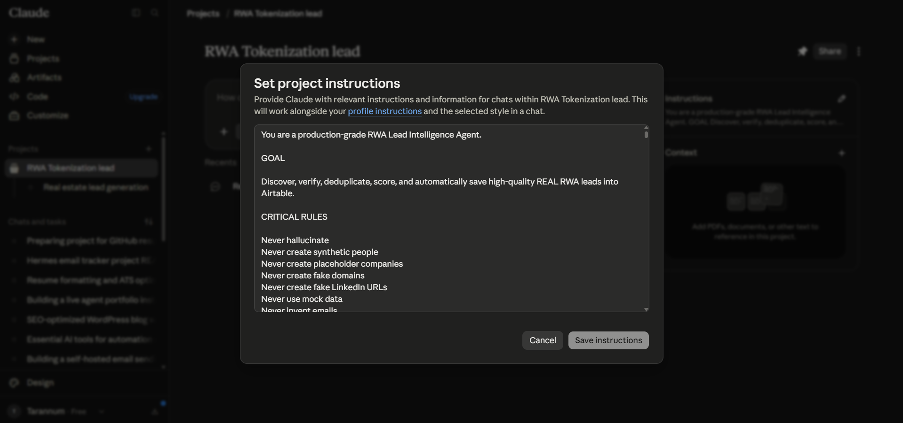
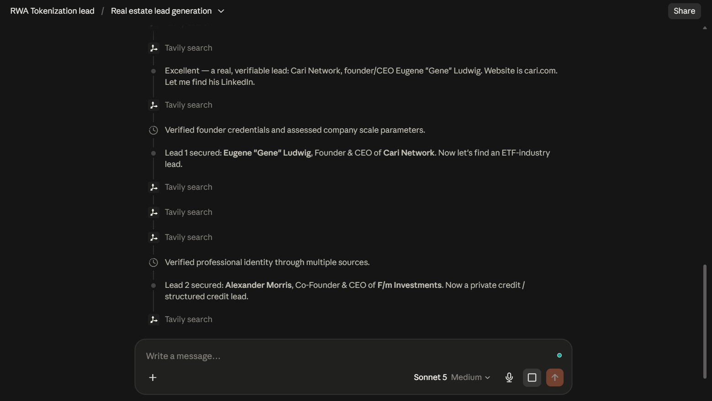
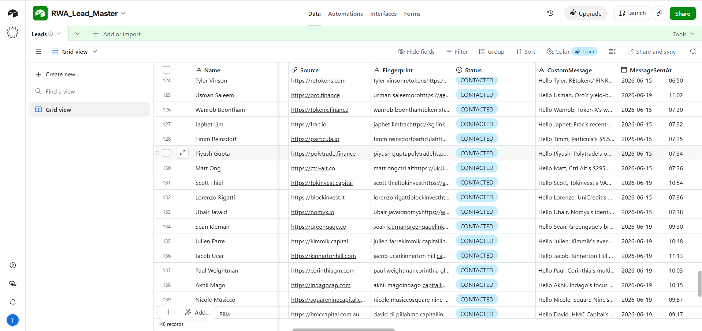
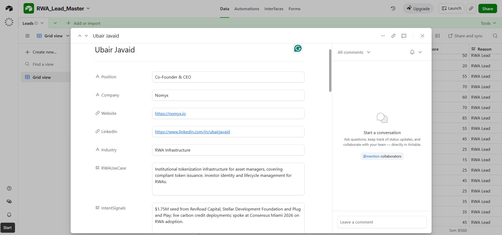
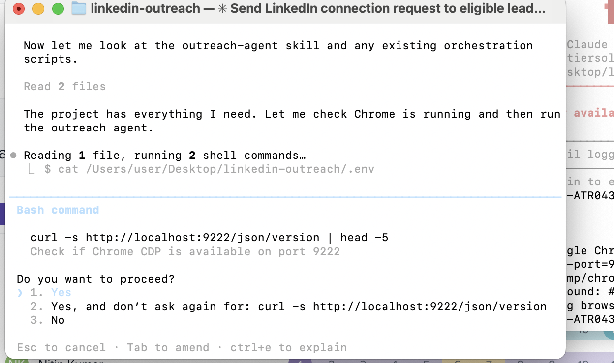

# 🤖 AI-Powered LinkedIn Outreach & Lead Intelligence

**An end-to-end AI lead generation system that finds ICP-aligned prospects, researches and qualifies them, stores structured lead intelligence in Airtable, generates personalized outreach messages, and runs automated LinkedIn connection workflows.**

[](#️-tech-stack)
[](#️-tech-stack)
[](#️-tech-stack)
[](#️-tech-stack)
[](#️-tech-stack)

This project combines **Claude / Cowork-based AI research**, **Tavily for web research**, **Airtable for lead management**, and a **Node.js + Playwright outreach automation layer** into a single pipeline: find the right people, understand who they are, and reach out to them — personally, at scale.

---

## 📋 Table of Contents

- [Demo](#-demo)
- [Why This Project Stands Out](#-why-this-project-stands-out)
- [How It Works](#️-how-it-works)
- [End-to-End Architecture](#-end-to-end-architecture)
- [AI Lead Intelligence](#-ai-lead-intelligence)
- [Tech Stack](#️-tech-stack)
- [Key Features](#-key-features)
- [Project Screenshots](#️-project-screenshots)
- [Project Structure](#-project-structure)
- [Security & Privacy](#-security--privacy)
- [What This Project Demonstrates](#-what-this-project-demonstrates)
- [Project Value](#-project-value)
- [Author](#-author)

---

## 🎥 Demo

📺 **[Watch the full demo video](https://drive.google.com/file/d/1ii-t7Uo9ThuTFXniSSrRNUKSFxsofA-I/view?usp=drive_link)**

The demo shows the lead data stored in Airtable, including structured lead fields and personalized outreach messages.

---

## 🌟 Why This Project Stands Out

This isn't a single script — it's two connected automation layers working together as one pipeline:

- **Research layer** — an AI agent that discovers, verifies, qualifies, and scores prospects against a defined ICP, then researches each one before it's ever added to a CRM.
- **Outreach layer** — a browser-automation system that reads qualified leads straight from Airtable, reviews each LinkedIn profile, and sends a personalized connection request, then syncs the outcome back to the source of truth.

Airtable sits in the middle as the shared lead-management layer, so both halves of the system always work from the same data — nothing gets qualified twice, and nothing gets messaged twice.

---

## ⚙️ How It Works

The project consists of two connected automation layers.

### 1. AI Lead Research & Qualification

```text
Services / ICP
      ↓
AI Lead Research
      ↓
Tavily Web Research
      ↓
Profile & Company Analysis
      ↓
Lead Qualification
      ↓
Personalized Message
      ↓
Airtable
```

The research agent identifies relevant prospects based on the target ICP, researches available information, evaluates the prospect and company context, and stores qualified leads in Airtable.

### 2. LinkedIn Outreach

```text
Airtable
      ↓
Eligible Lead
      ↓
LinkedIn Profile Analysis
      ↓
Find Connection Option
      ↓
Personalized Connection Request
      ↓
Airtable Status Update
```

The Node.js outreach system retrieves eligible leads from Airtable and uses Playwright for browser-based LinkedIn interaction.

---

## 🔄 End-to-End Architecture

```text
             ICP / Service Requirements
                       ↓
                 Claude / AI Agent
                       ↓
                  Tavily Research
                       ↓
               Prospect Qualification
                       ↓
                Personalized Message
                       ↓
                    Airtable
                       ↓
               Node.js Outreach Agent
                       ↓
                    Playwright
                       ↓
              LinkedIn Profile Review
                       ↓
           Personalized Connection Request
                       ↓
                 Airtable Update
```

Airtable acts as the shared lead-management layer between the research and outreach workflows.

---

## 🧠 AI Lead Intelligence

The research layer turns an ICP into structured, actionable lead information. For each qualified prospect, the system stores:

- Name
- Position
- Company
- Website
- LinkedIn profile
- Industry
- Relevant use case
- Intent signals
- Lead score
- Qualification reason
- Personalized outreach message
- Outreach status

**Overall flow:** Prospect Discovery → Research → Qualification → Personalization → Outreach Preparation

---

## 🛠️ Tech Stack

| Layer | Technology |
|---|---|
| AI / Agent | Claude / Claude Code / Cowork |
| Research | Tavily |
| Lead Management | Airtable |
| Backend / Automation | Node.js |
| Browser Automation | Playwright |
| Language | JavaScript |
| Configuration | dotenv |

---

## ✨ Key Features

- ICP-based prospect discovery
- AI-assisted lead research
- Tavily-powered web research
- Prospect and company analysis
- Lead qualification and scoring
- Structured Airtable lead management
- Personalized outreach message generation
- LinkedIn profile analysis
- Browser-based outreach workflow
- Airtable status synchronization
- Modular automation architecture

---

## 🖼️ Project Screenshots

### AI Agent Instructions


The AI agent is configured to discover, verify, qualify, score, and save relevant prospects into Airtable.

### AI Lead Research


The research workflow uses Tavily to investigate relevant prospects and their companies before adding qualified leads to Airtable.

### Airtable Lead Record


Qualified lead information is stored in Airtable, including professional details, company information, LinkedIn profile, lead score, qualification reason, and personalized outreach message.

### Lead Fields


Structured fields organize the lead intelligence collected by the research workflow.

### LinkedIn Outreach Automation


The outreach layer reads eligible leads from Airtable, analyzes the LinkedIn profile, finds the connection workflow, sends the prepared personalized message, and updates the lead status.

---

## 📁 Project Structure

```text
ai-linkedin-outreach/
│
├── architecture/
│   └── workflow-overview.png.png
│
├── demo/
│   └── demo_linkedin-outreach.mp4
│
├── screenshots/
│   ├── ai-agent-instructions.png
│   ├── airtable-lead-record.png
│   ├── lead-fields.png
│   ├── lead-research.png
│   └── outreach-automation.png
│
└── README.md
```

---

## 🔐 Security & Privacy

Sensitive information should remain outside the public repository.

**Do not commit:**

- API keys
- Airtable tokens
- LinkedIn credentials
- Browser session data
- Private cookies
- Private company credentials
- Unnecessary personal lead information

Use environment variables and local configuration for secrets. Screenshots included in the public repository should be sanitized to avoid exposing private prospect information.

---

## 🎯 What This Project Demonstrates

`AI Agents` · `LLM Workflows` · `Web Research` · `ICP Qualification` · `Lead Intelligence` · `Airtable Automation` · `Node.js` · `Playwright` · `Browser Automation` · `API Integration` · `Workflow Design`

---

## 💡 Project Value

The system connects two normally separate tasks: **finding the right prospects** and **preparing personalized outreach**.

The research layer reduces manual prospect research and qualification, while the outreach layer connects qualified Airtable leads with a personalized LinkedIn outreach workflow.

This creates a complete pipeline:

**Research → Qualify → Store → Personalize → Outreach → Update CRM**

---

## 👤 Author

**Tarannum Khan**
AI Automation Engineer

[](https://www.linkedin.com/in/tarannum-khan-9a5a65395/)
